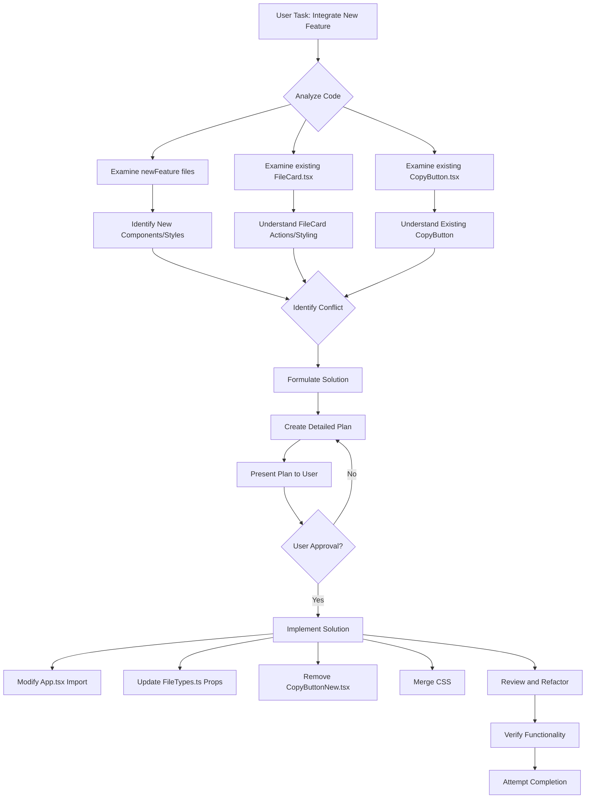

# Plan: Integrate Task Type Feature and Fix File Card Copy Button

This plan outlines the steps to integrate the new task type selection and management feature into the Electron app and resolve the issue where the file card incorrectly shows a copy button on hover.

**Problem:** The new feature introduces a different implementation of a copy button and potentially conflicting CSS, causing the file card's copy button to be visible on hover, overriding the intended behavior.

**Solution:** Modify the new feature's code to use the existing `CopyButton` component and ensure the CSS correctly controls the visibility of the file card actions.

**Plan Steps:**

1.  **Integrate New Feature Files:**

    - Copy the new feature files from the `newFeature` directory into the corresponding directories in `src/`.
      - `newFeature/AppNew.tsx` -> `src/App.tsx`
      - `newFeature/CopyButtonNew.tsx` -> `src/components/CopyButtonNew.tsx` (Temporarily, will be removed later)
      - `newFeature/CustomTaskTypeModalNew.tsx` -> `src/components/CustomTaskTypeModal.tsx`
      - `newFeature/FileTypesNew.ts` -> `src/types/FileTypes.ts`
      - `newFeature/indexNew.css` -> `src/styles/indexNew.css` (Temporarily, will be integrated later)
      - `newFeature/SidebarNew.tsx` -> `src/components/Sidebar.tsx`
      - `newFeature/TaskTypeSelectorNew.tsx` -> `src/components/TaskTypeSelector.tsx`
      - `newFeature/TaskTypesNew.ts` -> `src/types/TaskTypes.ts`
      - `newFeature/UserInstructionsNew.tsx` -> `src/components/UserInstructions.tsx`

2.  **Address Copy Button Conflict:**

    - Modify the new `src/App.tsx` to import the existing `src/components/CopyButton.tsx` instead of the new `CopyButtonNew.tsx`.
    - Modify the new `src/types/FileTypes.ts` to ensure the `CopyButtonProps` interface matches the one in the existing `src/components/CopyButton.tsx`.
    - Remove the temporary `src/components/CopyButtonNew.tsx` file as it's no longer needed.

3.  **Integrate CSS:**

    - Merge the relevant styles from `src/styles/indexNew.css` into the main stylesheet `src/styles/index.css`. Carefully review the new styles to ensure they don't introduce unintended side effects or conflicts with existing styles, particularly regarding the `.file-card-actions` and copy button visibility.
    - Remove the temporary `src/styles/indexNew.css` file.

4.  **Review and Refactor:**
    - Review all integrated files (`src/App.tsx`, `src/components/CustomTaskTypeModal.tsx`, `src/types/FileTypes.ts`, `src/components/Sidebar.tsx`, `src/components/TaskTypeSelector.tsx`, `src/types/TaskTypes.ts`, `src/components/UserInstructions.tsx`, and `src/styles/index.css`) to ensure correct imports, prop types, and styling.
    - Verify that the task type selection and management features work as expected.
    - Confirm that the file card's copy button is only visible on hover as intended.

**Mermaid Diagram:**

